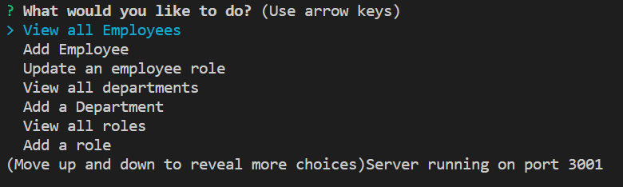

# Employee Database     

In this project, I was asked to build a bespoke Content Management System (CMS) so that a company could easily perform CRUD tasks on their employee database. 

To do this I utilised Node.js, Inquirer and MySQL packages to enable the user to perform these tasks at the command line by answering pre-determined questions.

## Table of Contents

[Installation](#installation)

[Usage](#usage)

[Contributing](#contributing)

[License](#license)

[Questions](#questions)

[Links](#links)

## Installation

To install this you will need to run: 'npm install' on the command line

## Usage

To start you will need to type 'node index.js' into the command line

## Contributing

To contribute to this, clone the repo locally and commit on a seperate branch

## License

This application is covered under the following license: The Unlicence

## Links

I have created a walkthrough video that dem onstrates the functionality of the application which can be viewed by [clicking here](https://drive.google.com/file/d/1hDlmzuwOKSTTO4-Qiv6TIIBAOH4SaaD_/view)

